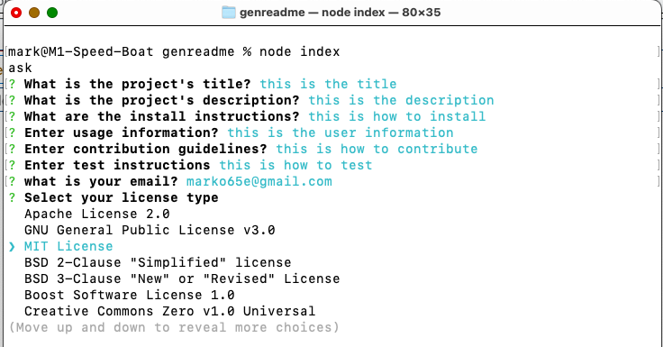

# My project

## Description

The project is to generate a readme file

## Table of Contents

- [My project](#my-project)
  - [Description](#description)
  - [Table of Contents](#table-of-contents)
  - [Installation](#installation)
  - [Usage](#usage)
    - [Screenshots](#screenshots)
  - [Credits](#credits)
  - [Features](#features)
  - [Tests](#tests)
  - [Deployment](#deployment)
  - [References](#references)
  - [Feedback](#feedback)

## Installation

Copy to folder

## Usage

use it to build file

### Screenshots
  

## Credits
  
Here are the credits

## Features
  
here are features

## Tests
  
Test it by running node index

## Deployment

here is deployment

## References

here are references
m@abc.com

## Feedback

my github
m@abc.com
enter feedback
